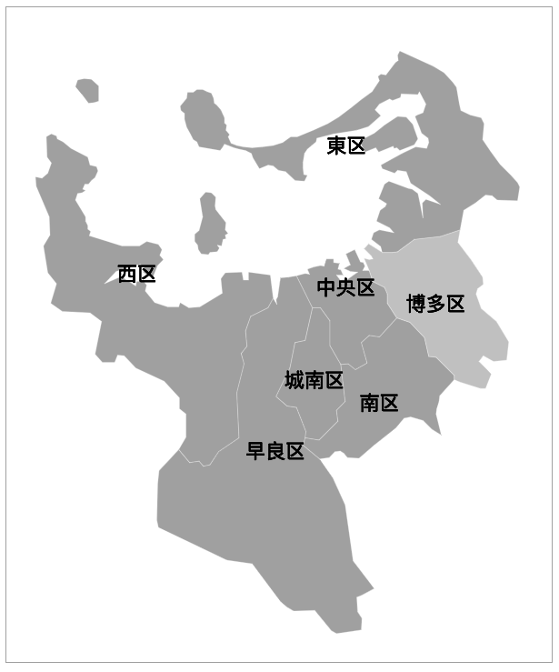

# fukuoka-map
Clickable map of city ward of Fukuoka. It is from [japan-map](http://takemaru-hirai.github.io/japan-map/) and it is based on jQuery.

# Setup

Create a div element to hold the map

```html
<div id="my-map"></div>
```

Turn the element into a Fukuoka Map with some simple javascript

```javascript
$(function(){
  $("#my-map").fukuokaMap({
    width: 600,
    height: 720,
    showsKuName: true,
    onSelect : function(data){
      alert(data.name);
    }
  });
});
```

# Usage

## Example 1
Alert city ward name when clicking, please check `example1.html` file in `examples` folder for more details.  


